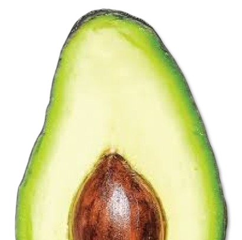

---
# Avocado
Avocado is a modular video editing engine, built around a plugin-driven architecture.

## Building

>Building Avocado is complex and temporary at this stage of development and will be changed in the future.

Requirements:
- Visual Studio 2022
- Vulkan SDK (1.4.xxx.x or greater)

### Building Steps for Windows:

1. Go to your environment variables and add a variable named "VULKAN_SDK" with the path to your Vulkan SDK installation (e.g., C:/VulkanSDK/[your version]).

2. To build *Avocado* you need to first build thirdparty requirements:
    - GLFW
    - spdlog

    > Make sure you build them as dynamic libraries

3. Once you have build them, copy the results to the appropriate folders, for example: [your_path_to_avocado]/Avocado/GLFW/lib

4. After that, compile the shaders required for Avocado to run. To do this, navigate to "Avocado/shaders/vulkan/", locate the "test-shader-compile.bat" batch file, run it, and ensure there are no errors.

5. Once you have completed the steps above, open the "build" folder, run the "win_generate_project.bat" script, and ensure there are no errors. After that, open the solution and build it.

## Usage
Avocado on current stage is unusable and WIP

## Contributing
Pull requests are welcome. For major changes, please open an issue first
to discuss what you would like to change.

Please make sure to update tests as appropriate.

## License
[GPL 3.0](LICENSE)